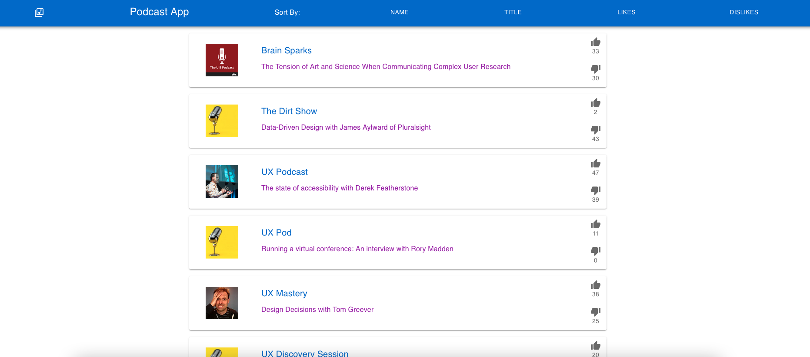
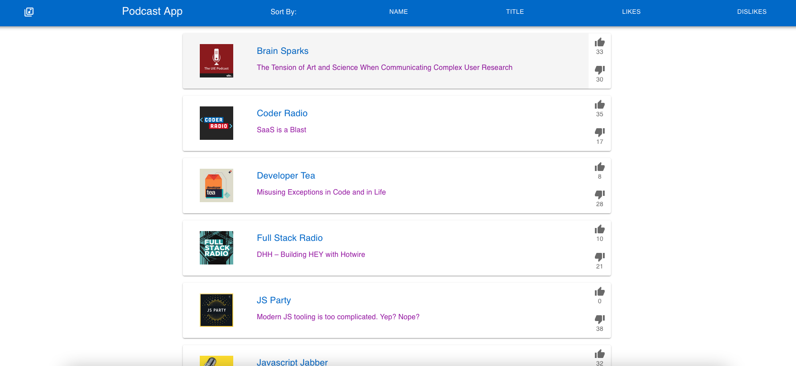
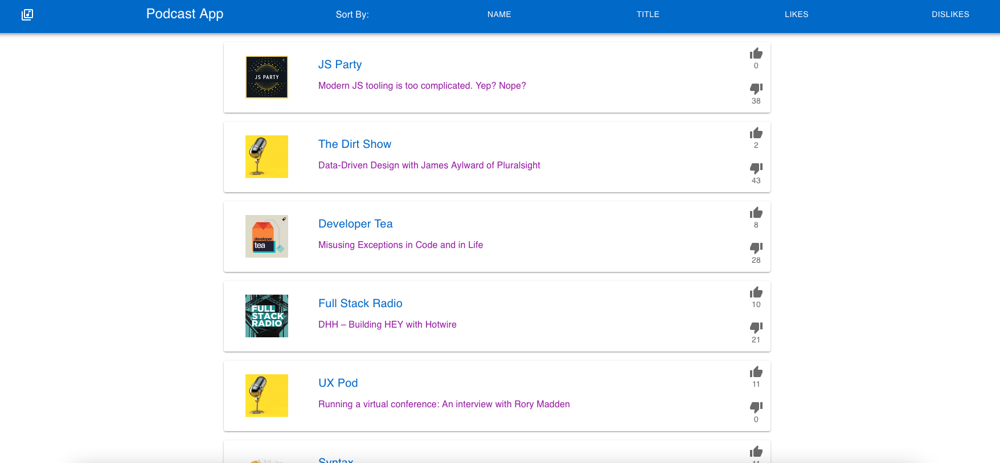
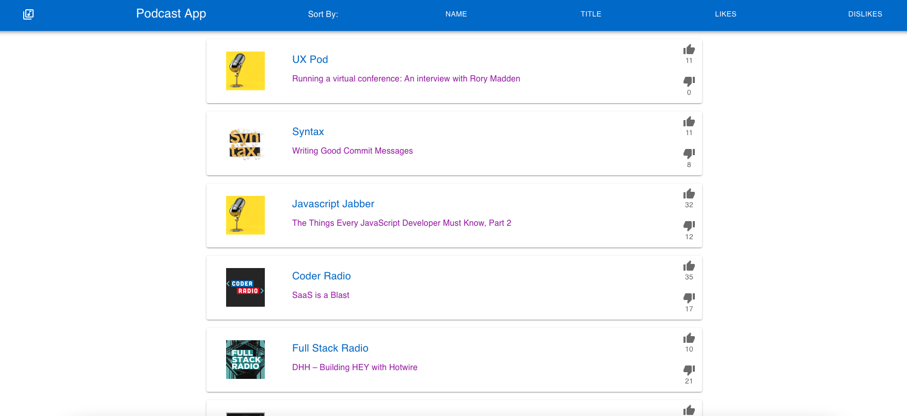
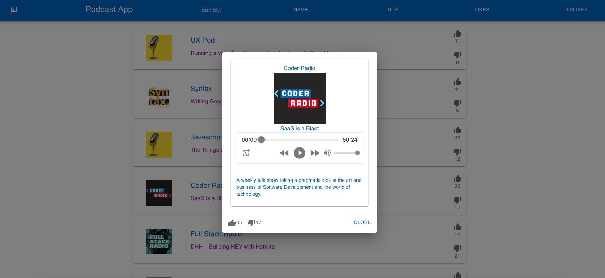
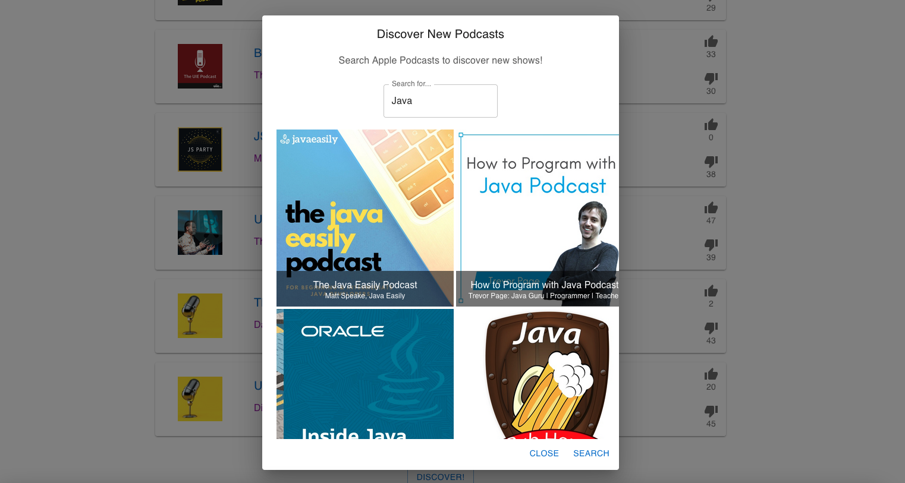

# Podcast Application
Created as a finalist project for the SiriusXM + Pandora Apprenticeship

## Summary
An application that allows users to save, sort, and play a list of podcasts.
* Users can click on a podcast to view it's details and play it
* Users can add a podcast to the list(must have all required information fields, and submit form)
* Users can like or dislike a podcast, as well as see how many likes and dislikes the podcast has.
* Users can sort the list by name, title, number of likes, and number of dislikes.

## Project Details
Main Page:

Sort By Name:

Sort By Title:

Sort By Likes:

Sort By Dislikes:

Open/View/Play Podcast:

Discover:

### File Structure And Architecture:
High Level Overview:
Project has a frontend written in React and a backend server created with Java Spring Boot.
Data model has a single entity, the Podcast. The backend has REST controlled endpoints that use functions provided by a Service class which in turn utilizes a Repository class to communicate with the database.
I chose to use a Postgres database for this project because it is what I am most familiar with. A NoSQL database would probably have worked just as well given the simple nature of the application.
The front end utilizes views and controllers to serve content and make requests to the backend server. As much as possible, the business logic is separated out from the view componenets.
Right now, the application utilizes a command line runner to load database when application starts. It is configured to drop tables when application ends, and create them again on new run. This is for the dev environment, a production database would obviously need to persist.

Applogies for any confusing explanations here, writing very fast.

### Requirements:
#### Application can be interacted with in a minimum of 3 ways
1. Users can view the list of podcasts
2. Users can open a podcast from the list and listen to it
3. Users can like a podcast
4. Users can dislike a podcast
5. Users can sort the podcast list in 4 different ways
6. Users can use the discovery feature to find new podcasts on iTunes

#### Application uses a specified architectural pattern
* Application follows MVC pattern

#### Integration with a backend service developed by you with CRUD operations
* Backend service manages the podcast list that is stored in a database
* Has operations to create, read, update, and delete a podcast. 
  The delete capability is currently unused, but exists anyway to be thorough.

#### Integration with a 3rd party RESTful API
* Application utilizes the iTunes search API to allow users to discover new podcasts based on a search term.

#### Usage of at least 1 Object Oriented principle
Uses abstraction and encapsulation in both server side functions from controller going through service/repository to abstract away from places that don't need access to that information

### Live Link:
I honestly spent a panicked amount of time trying to deploy this before the deadline, unfortunately without success
https://stark-waters-88529.herokuapp.com/
### Installation Instructions
download project

run `mvn clean install` to install dependencies

run `./mvnw spring-boot:run` to run program

check out the project at `localhost:8080/`